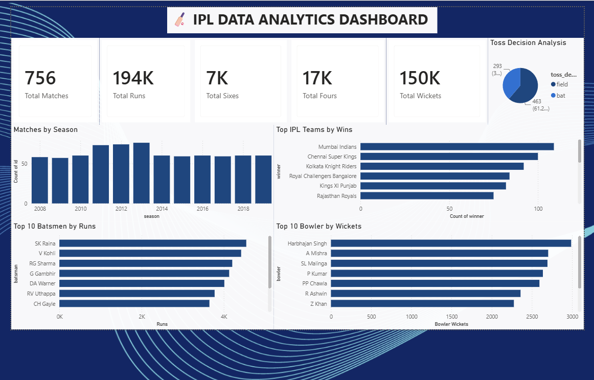
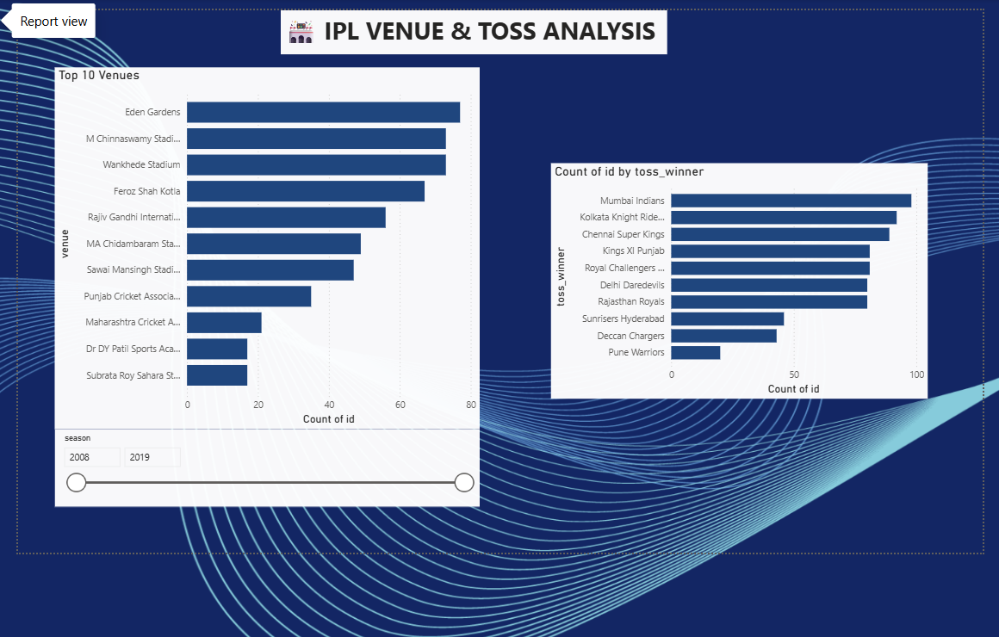

# 🏏 IPL Data Analytics Dashboard using Power BI

## 📌 Project Overview

This project analyzes IPL match data using Power BI and DAX.

The dashboard provides insights into:

- Total Matches
- Total Runs
- Total Sixes
- Total Fours
- Total Wickets
- Matches by Season
- Top IPL Teams by Wins
- Top 10 Batsmen by Runs
- Top 10 Bowlers by Wickets
- Toss Decision Analysis
- Top 10 Venues
- Top 10 Toss Winners

---

## 🛠 Tools Used

- Power BI
- DAX
- Data Modeling
- CSV Dataset
- GitHub

---

## 📂 Dataset

- matches.csv
- deliveries.csv

---

## 📷 Dashboard Preview

### Page 1

### Page 2

---

## 🚀 Author

Ritik Kumar Singh
ECE Graduate | Data Analytics Enthusiast
